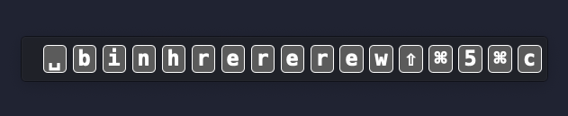

#
<p align="center">

<h1 align="center">TypeView - Keystroke Visualizer</h1>
<h3 align="center">Visualize your keystrokes in real-time. Perfect for tutorials and presentations.
<br>
<a href="https://typeview.db99.dev/">[Landing Page]</a>
</p>

## Screenshot
<p align="center">
<picture>
  <source media="(prefers-color-scheme: dark)" srcset="./website/sc.png">
  
</picture>
</p>

## Demo Video
https://github.com/dunkbing/typeview/assets/42113525/6db87b98-512a-4c35-8f81-8084e4ad0eb0

## Features

- **Real-time Visualization**: Shows your keystrokes with a clean overlay.
- **Mechanical Key Sound**: Simulates mechanical key sounds.
- **Lightweight**: Minimal performance impact.

## Installation

### macOS

If you encounter errors when opening the app, run:

```bash
xattr -rc /Applications/TypeView.app && codesign --force --deep --sign - /Applications/TypeView.app
```

This command resets the extended attributes of the app and re-signs it.

### Windows

Download the installer and follow the on-screen instructions to complete the installation.

## Usage

Open TypeView and start typing. Your keystrokes will be visualized in real-time.
